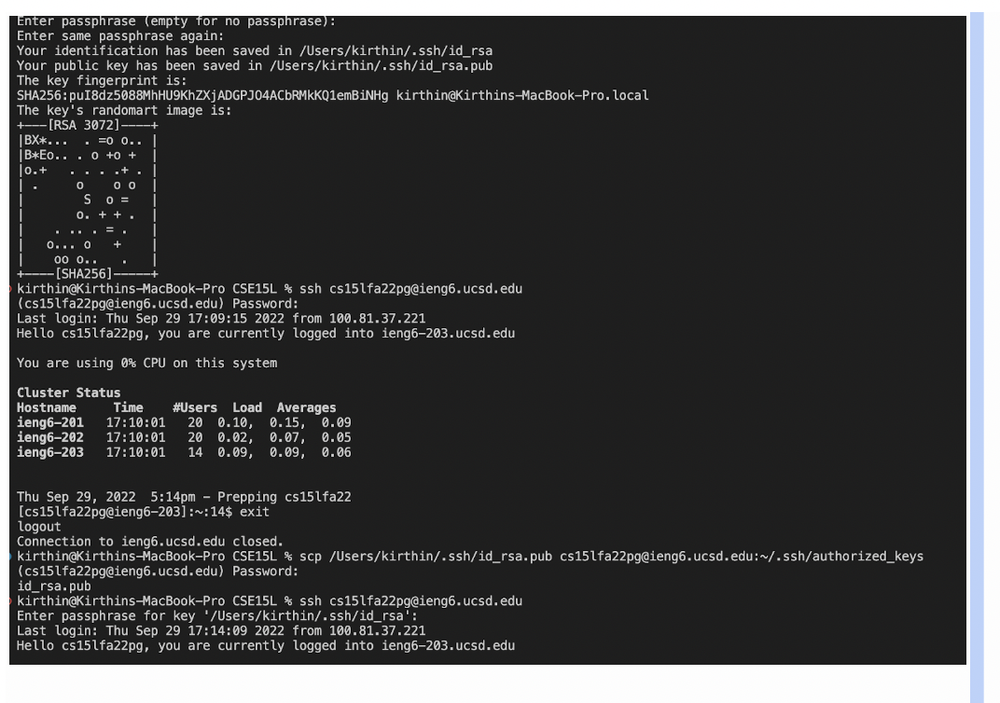

# Week 1 Lab Report
## 1. Installing VScode
In order to download VScode, head to the website [https://code.visualstudio.com/](https://code.visualstudio.com/) and follow the instructions for your respective device. IF you have a Mac, download the Mac version and if you have Windows, download the widnows version. 
## 2. Remotely Connecting
After downloading VScode, open a terminal and enter the following in there:
```
ssh cs15lfa22zz@ieng6.ucsd.edu
```
Depending on your credentials, the "zz" will change. Once logging in, it will prompt you with warning message asking if you want to connect to the server. Type "yes" and it will then prompt you to enter your password. After entering your password, you will get the following screen showing that you have connected to the remote server. 

## 3. Trying Some Commands
After connecting you can try some of these commands: `cd`, `ls`, `pwd`, `mkdir`, and `cp`. There are more commands than this. The `cd` command will change the directory, the `ls` will list the files in your directory, `pwd` will print the path of the directory, and `cp` will copy files from one loaction in your directory to another. 

## 4. Moving Files with `scp`
To move files using `scp`, first create a file on your own computer, not the remote one. After creating the file, enter the following into your terminal:
```
scp [file] cs15lfa22zz@ieng6.ucsd.edu:~/
```
Once again, the login credentials will be dependent on the user. It will then prompt you to enter your password again, so type it in. After this connect to the ssh server and type `ls` command. You will see your file in the directory. 

## 5. Setting an SSH Key
On your own computer, (logout of the ssh server by typing `exit`) type a command called `ssh-keygen`. It will then prompt you to type where you want the passkey to be saved. After doing that, it will ask you to enter a passkey which could be anything. Then retype it. After doing all this it will look something like this. 

## 6. Omptimizing Remote Running 
To omptimize remote running, you can add commands right after entering the log-in info in double quotes like this:
```
ssh cs15lfa22zz@ieng6.ucsd.edu "mkdir file"
```
This will allow you to run things faster. Also having the passkey, allows you to log-in more quickly. 

